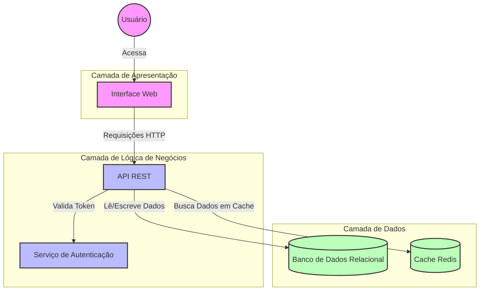
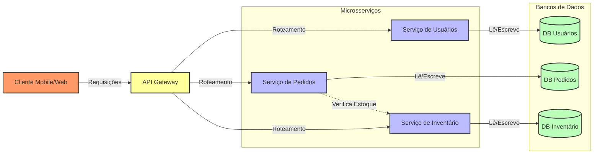
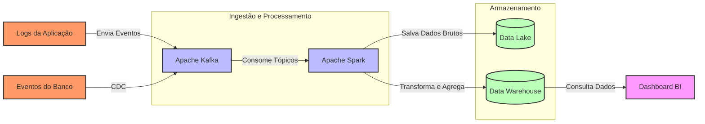

# Exemplos de Diagramas de Arquitetura em Mermaid

## Arquitetura Web em Três Camadas

Este exemplo demonstra uma arquitetura web clássica com frontend, backend e banco de dados.

## Arquitetura de Microsserviços

Este exemplo mostra uma arquitetura baseada em microsserviços com um API Gateway.

## Pipeline de Dados

Este exemplo ilustra um fluxo de processamento de dados.

